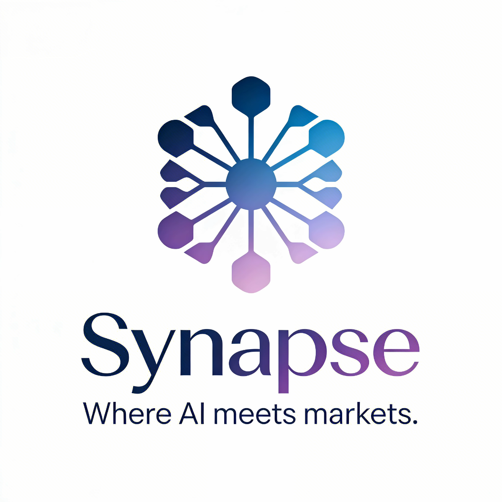
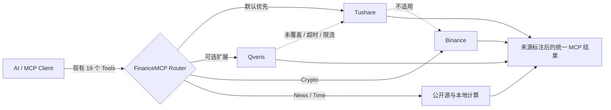
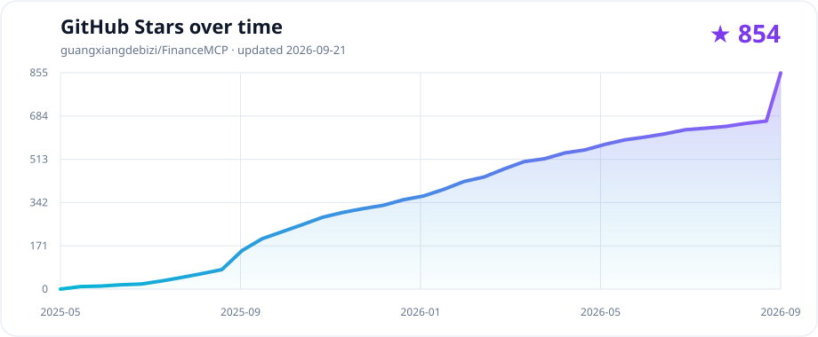

<div align="center">
  <a href="https://github.com/guangxiangdebizi/FinanceMCP">
    
  </a>

  <h1>FinanceMCP <sub>Synapse</sub></h1>

  <p><strong>为 AI Agent 提供统一、可路由、可追溯的多市场金融数据</strong></p>
  <p>19 个稳定 MCP Tools · Tushare / Qveris / Binance · stdio + Streamable HTTP</p>

  <p>
    <a href="https://www.npmjs.com/package/finance-mcp"></a>
    <a href="https://www.npmjs.com/package/finance-mcp"></a>
    <a href="https://github.com/guangxiangdebizi/FinanceMCP/releases"></a>
    <a href="https://github.com/guangxiangdebizi/FinanceMCP/stargazers"></a>
    <a href="LICENSE"></a>
    
  </p>

  <p>
    <a href="https://mcptoplist.com/server/pulsemcp%2Fguangxiangdebizi-finance-market-data"></a>
    <a href="https://smithery.ai/servers/@guangxiangdebizi/FinanceMCP"></a>
  </p>

  <p>
    <a href="#quick-start">快速开始</a> ·
    <a href="#routing">数据源路由</a> ·
    <a href="#providers">API 获取</a> ·
    <a href="#tools">Tools</a> ·
    <a href="#security">安全</a> ·
    <a href="#stars">Star 趋势</a> ·
    <a href="README_EN.md">English</a>
  </p>
</div>

> [!IMPORTANT]
> **v4.10.0** 在保留现有 19 个 Tool 名称与参数的前提下，新增按请求凭证裁剪 `tools/list` 的能力，并保留 v4.9.0 的 Qveris 路由、自动降级和来源标注。

> [!NOTE]
> 需要在 Trae、Cursor、Claude Code 和 Codex 之间共享模型 Prompt/KV-cache 路由及对话 lineage 时，可选启动独立的 [`finance-cache-gateway`](./docs/cache-gateway.md)。它使用单独的进程、端口和配置；不修改现有 MCP Tool、stdio 或 `/mcp` 接口，不启用时现有用法完全不变。

## 🔗 项目联动：FinNote 智能金融文档系统

FinanceMCP 已与 [MarkiNote](https://github.com/wink-wink-wink555/MarkiNote) 进行项目联动与融合，形成面向金融研究、AI 分析与智能文档管理场景的一体化系统 **FinNote**。该项目已参加上海市大学生计算机应用能力大赛并获得二等奖。

🌐 **在线体验：[https://finvestai.top/](https://finvestai.top/)**  
📝 **MarkiNote：[https://github.com/wink-wink-wink555/MarkiNote](https://github.com/wink-wink-wink555/MarkiNote)**

在 FinNote 的整体架构中，FinanceMCP 作为核心的 **金融数据与 MCP 工具服务层**，基于 Node.js、Express 与 Model Context Protocol（MCP）SDK 构建。目前通过 19 个稳定的 MCP 工具，为 AI Agent 提供股票、基金、债券、宏观经济、财经新闻、技术指标以及多市场行情等金融数据能力，并支持 stdio 与 Streamable HTTP 两种接入方式。

MarkiNote 则作为上层 **AI Agent 智能文档与知识管理系统**，负责承载自然语言交互、AI 分析结果展示、Markdown 文档生成、编辑与长期知识沉淀。在 FinNote 场景中，MarkiNote 通过 HTTP / MCP 服务链路调用 FinanceMCP，使金融数据能力能够直接进入 AI Agent 的推理与文档工作流。

整体流程形成：

**自然语言提问 → AI Agent 任务理解 → FinanceMCP 工具调用 → 多源金融数据获取 → AI 智能分析 → Markdown 文档生成 → 文档管理与知识沉淀**

因此，FinanceMCP 不仅可以作为独立的金融数据 MCP Server 接入 Claude、Cursor、Codex 等 MCP Client 或 AI Agent，也可以作为 FinNote 等上层 AI 应用的金融数据基础设施，为智能投研、金融分析和文档型 Agent 提供统一、结构化、可调用且可追溯的数据能力。

## ✨ 核心亮点

| | 能力 | 说明 |
|---|---|---|
| 🔌 | **无侵入式扩展** | 保持现有 19 个 Tool 名称和参数，数据源选择由请求上下文完成 |
| 🧭 | **智能路由** | 同时支持 Tushare、Qveris、Binance 与公开新闻源 |
| 🔁 | **自动降级** | 首选来源未覆盖、超时、限流或不可用时按优先级继续尝试 |
| 🏷️ | **来源透明** | 每次返回都标注实际数据来源；发生降级时同时返回完整路由 |
| 🛡️ | **请求级隔离** | HTTP Key 通过 AsyncLocalStorage 隔离，日志统一脱敏 |
| 📈 | **多市场覆盖** | A 股、港股、美股、指数、基金、债券、期货、外汇、宏观与加密资产 |
| 🧮 | **技术指标引擎** | MACD、RSI、KDJ、BOLL、MA 自动扩展历史窗口后再计算 |
| 🚀 | **双传输模式** | 同时支持本地 stdio 与远程 Streamable HTTP |

<a id="routing"></a>

## 🧭 数据源路由



### HTTP 请求头

```http
X-Tushare-Token: YOUR_TUSHARE_TOKEN
X-Qveris-Api-Key: YOUR_QVERIS_API_KEY
X-Finance-Source-Priority: qveris,tushare,binance
```

默认优先级：

```text
tushare,qveris,binance
```

路由行为：

1. 只传一种凭证时，优先使用该凭证对应的数据源。
2. 同时传入 Tushare 与 Qveris 凭证时，默认 Tushare 优先。
3. `X-Finance-Source-Priority` 可按请求调整顺序；未知项忽略、重复项去重、遗漏项按默认顺序补齐。
4. 首选数据源接口未覆盖或调用失败时自动降级；正常空结果不会触发重复请求。
5. Qveris 内部执行 **Discover → Inspect → Probe → Call**，每次 MCP 请求最多执行一次可能计费的 Call。

返回示例：

```text
数据来源: Tushare
数据源路由: Qveris（接口未覆盖） → Tushare（成功）

原有工具结果……
```

> [!NOTE]
> Qveris 是可选扩展。未提供 `X-Qveris-Api-Key` / `QVERIS_API_KEY` 时不会调用 Qveris，也不会消耗 credits。接口契约参见 [Qveris REST API](https://qveris.ai/docs/rest-api)。

### 按凭证动态显示 Tools

`tools/list` 会根据当前 MCP 请求实际携带的凭证裁剪工具目录：只传 Qveris Key 时只展示 Qveris adapter 覆盖的现有 Tools，只传 Tushare Token 时只展示 Tushare 覆盖的 Tools；同时传入两者时展示两者的并集。没有凭证时仅展示公共数据源与本地工具。`tools/call` 也执行相同校验，避免 AI 调用到当前请求无法使用的数据源。

<a id="providers"></a>

## 🔑 数据源与 API 获取

| 数据源 | 是否需要凭证 | 官方获取入口 | FinanceMCP 配置 |
|---|---|---|---|
| **Tushare Pro** | 需要 Token | [注册账号](https://tushare.pro/document/1?doc_id=38) · [获取 Token](https://tushare.pro/document/1?doc_id=39) | stdio：`TUSHARE_TOKEN`；HTTP：`X-Tushare-Token` |
| **Qveris** | 需要 API Key | [Dashboard / API Keys](https://qveris.ai/account?page=api-keys) · [官方文档](https://qveris.ai/docs) | stdio：`QVERIS_API_KEY`；HTTP：`X-Qveris-Api-Key` |
| **Binance Public API** | **不需要** | [Spot REST API 文档](https://developers.binance.com/docs/binance-spot-api-docs/rest-api) | 无需配置；加密资产行情自动使用公开接口 |
| **百度新闻** | **不需要** | 无需申请 API | 无需配置；`finance_news` 使用公开新闻检索 |
| **本地系统时钟** | **不需要** | 无 | 无需配置；仅供 `current_timestamp` 使用 |

### Tushare Token

1. 在 [Tushare](https://tushare.pro/) 注册并登录。
2. 进入 **个人中心 → 账号与 TOKEN**，复制 Token；完整步骤见 [官方 Token 指南](https://tushare.pro/document/1?doc_id=39)。
3. 将 Token 写入本地 `TUSHARE_TOKEN`，或在远程 MCP 请求中通过 `X-Tushare-Token` 传递。

> [!TIP]
> 🎓 **Tushare 高校学生认证可免费获得 2000 积分。** 当前官方流程要求完善学校和个人资料、加入高校用户群，并向管理员提交学生证或学信网截图及 Tushare ID。入口与最新步骤见 [学生免费积分获取](https://tushare.pro/document/1?doc_id=360)。Tushare 服务协议同时说明，高校学生和教师完成身份确认后分别可获得 **2000 / 5000 积分**权限。不同接口的积分门槛与频次不同，请以对应接口文档和[积分权限页面](https://tushare.pro/weborder/#/permission)为准。

### Qveris API Key

1. 登录 [Qveris](https://qveris.ai/)，打开 [Dashboard / API Keys](https://qveris.ai/account?page=api-keys)。
2. 创建并复制 API Key。Qveris 当前为新账号提供 1000 credits；Discover、Inspect 免费，实际 Call 可能按能力计费。
3. 将 Key 写入本地 `QVERIS_API_KEY`，或在远程 MCP 请求中通过独立的 `X-Qveris-Api-Key` 传递。

### 无 Key 数据源

- **Binance**：FinanceMCP 当前只调用安全类型为 `NONE` 的公开 K 线接口，不需要 Binance 账号、API Key 或交易权限。
- **百度新闻**：使用公开新闻搜索，不需要开发者凭证；若网络或上游检索不可用，可按配置的优先级尝试 Qveris 新闻能力。

> [!WARNING]
> 不要把真实 Token / API Key 写进 README、MCP 配置示例或提交到 Git。推荐使用 `.env`、客户端环境变量或每次 HTTP 请求的 Header。

<a id="quick-start"></a>

## 🚀 快速开始

### npm / stdio

```bash
npx -y finance-mcp
```

Claude Desktop、Cursor 等本地 MCP 客户端配置：

```json
{
  "mcpServers": {
    "finance-mcp": {
      "command": "npx",
      "args": ["-y", "finance-mcp"],
      "env": {
        "TUSHARE_TOKEN": "YOUR_TUSHARE_TOKEN",
        "QVERIS_API_KEY": "YOUR_QVERIS_API_KEY",
        "FINANCE_SOURCE_PRIORITY": "tushare,qveris,binance"
      }
    }
  }
}
```

### Streamable HTTP

在线 Endpoint：[`https://finvestai.top/mcp`](https://finvestai.top/mcp)

```json
{
  "mcpServers": {
    "finance-mcp": {
      "type": "streamableHttp",
      "url": "https://finvestai.top/mcp",
      "timeout": 600,
      "headers": {
        "X-Tushare-Token": "YOUR_TUSHARE_TOKEN",
        "X-Qveris-Api-Key": "YOUR_QVERIS_API_KEY",
        "X-Finance-Source-Priority": "qveris,tushare,binance"
      }
    }
  }
}
```

两个 Key 都是可选的，可以只传其中一个。`Authorization: Bearer ...` 与 `X-Api-Key` 继续兼容为 Tushare Token；Qveris 使用独立的 `X-Qveris-Api-Key`。

<details>
<summary><strong>环境变量</strong></summary>

| 变量 | 默认值 | 说明 |
|---|---|---|
| `TUSHARE_TOKEN` | 空 | Tushare 凭证 |
| `QVERIS_API_KEY` | 空 | Qveris 凭证 |
| `QVERIS_BASE_URL` | `https://qveris.ai/api/v1` | Qveris REST API 地址 |
| `FINANCE_SOURCE_PRIORITY` | `tushare,qveris,binance` | stdio 或服务端默认优先级 |
| `PORT` | `3000` | HTTP 服务端口 |

</details>

<a id="tools"></a>

## 🧰 19 个 MCP Tools

| Tool | 功能 | 数据源 / 接口商 |
|---|---|---|
| `current_timestamp` | UTC+8 当前时间戳 | 本地系统时钟 |
| `finance_news` | 财经新闻关键词检索 | 百度新闻 · Qveris* |
| `stock_data` | 多市场历史行情与技术指标 | Tushare Pro · Qveris* · Binance Public API（加密资产） |
| `stock_data_minutes` | A 股与加密资产分钟 K 线 | Tushare Pro · Qveris* · Binance Public API（加密资产） |
| `index_data` | 指数行情、基本信息与估值 | Tushare Pro · Qveris* |
| `macro_econ` | GDP、CPI、PPI、PMI、Shibor、LPR、Libor、Hibor 等 | Tushare Pro · Qveris* |
| `company_performance` | A 股公司、财务、分红、股东与估值数据 | Tushare Pro · Qveris* |
| `company_performance_hk` | 港股利润表、资产负债表与现金流量表 | Tushare Pro · Qveris* |
| `company_performance_us` | 美股财务报表与指标 | Tushare Pro · Qveris* |
| `fund_data` | 基金净值、持仓、分红与基础资料 | Tushare Pro |
| `fund_manager_by_name` | 基金经理及管理基金查询 | Tushare Pro |
| `convertible_bond` | 可转债全生命周期数据 | Tushare Pro |
| `block_trade` | 大宗交易明细 | Tushare Pro |
| `money_flow` | 个股、大盘、行业与互联互通资金流 | Tushare Pro |
| `margin_trade` | 融资融券与转融券数据 | Tushare Pro |
| `csi_index_constituents` | CSI 指数表现、成分权重与财务摘要 | Tushare Pro · Qveris* |
| `dragon_tiger_inst` | 龙虎榜机构交易明细 | Tushare Pro |
| `hot_news_7x24` | 7×24 财经热点与内容去重 | Tushare Pro · Qveris* |
| `futures_data` | 期货会员持仓排名 | Tushare Pro |

> **Qveris\*** 是动态数据能力路由层，会按查询自动选择已接入的实际接口商（例如 Finnhub、Tiingo 等）；最终选中的接口商、能力 ID 与数据来源会随 Tool 结果一起返回。未标记 Qveris 的 Tool 会明确返回“接口未覆盖”，再降级到表内原生数据源。

## 📊 技术指标

```text
macd(12,26,9)   rsi(14)   kdj(9,3,3)   boll(20,2)   ma(5) ma(10) ma(20)
```

`stock_data` 会自动预取指标所需的额外历史数据，计算完成后再裁剪到用户请求区间。带技术指标的请求保持使用原生数据源，确保既有计算与展示格式稳定。

## 🛠️ 本地开发

```bash
git clone https://github.com/guangxiangdebizi/FinanceMCP.git
cd FinanceMCP
cp .env.example .env
npm ci
npm test
```

```bash
npm run start:stdio   # stdio
npm run start:http    # http://127.0.0.1:3000/mcp
```

`node_modules/` 与 `build/` 是本地生成物，不纳入 Git 跟踪。npm 发布时会通过 `prepare` 自动构建，仅打包运行所需的 `build/`。

<a id="security"></a>

## 🛡️ 安全设计

- API Key 仅从请求 Header 或环境变量读取，不写入仓库。
- HTTP 请求凭证按请求隔离，敏感 Header 在日志中显示为 `[REDACTED]`。
- `QVERIS_BASE_URL` 默认强制 HTTPS；仅 loopback 地址允许 HTTP 回归测试。
- Qveris 候选能力经过只读过滤、参数 Probe、响应大小限制与超时控制。
- `.env`、依赖目录、构建产物、日志和本地研究资料均由 Git ignore 规则管理。

<a id="stars"></a>

## ⭐ Star 趋势

<p align="center">
  <a href="https://github.com/guangxiangdebizi/FinanceMCP/stargazers">
    
  </a>
</p>

如果 FinanceMCP 对你有帮助，欢迎点一个 ⭐。趋势图由仓库自己的 GitHub Actions 每周一自动更新，也支持手动刷新；使用仓库临时 `GITHUB_TOKEN`，不依赖第三方 Star 抓取服务或长期凭证。

## 🤝 生态与贡献

<p align="center">
  <a href="https://glama.ai/mcp/servers/@guangxiangdebizi/my-mcp-server">
    
  </a>
</p>

- FinanceMCP 可作为 [FinNote / MarkiNote](https://github.com/wink-wink-wink555/MarkiNote) 的金融数据后端。
- 在线体验：[finvestai.top](https://finvestai.top/)
- MCP 生态收录：[Glama](https://glama.ai/mcp/servers/@guangxiangdebizi/my-mcp-server) · [Smithery](https://smithery.ai/servers/@guangxiangdebizi/FinanceMCP) · [MCP Toplist](https://mcptoplist.com/server/pulsemcp%2Fguangxiangdebizi-finance-market-data)
- 视频教程：[FinanceMCP 完整使用指南](https://www.bilibili.com/video/BV1qeNnzEEQi/)
- Bug 与功能建议：[GitHub Issues](https://github.com/guangxiangdebizi/FinanceMCP/issues)

欢迎提交 Issue 或 Pull Request。新增数据能力时优先兼容现有聚合 Tool，避免一接口一 Tool 的表面扩张。

## 📄 License

[MIT](LICENSE)
