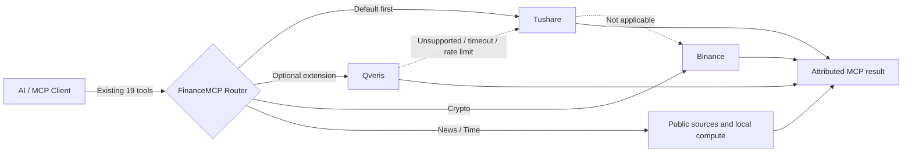

<div align="center">
  <a href="https://github.com/guangxiangdebizi/FinanceMCP">
    
  </a>

  <h1>FinanceMCP <sub>Synapse</sub></h1>

  <p><strong>Unified, routable, and attributable multi-market financial data for AI agents</strong></p>
  <p>19 stable MCP tools · Tushare / Qveris / Binance · stdio + Streamable HTTP</p>

  <p>
    <a href="https://www.npmjs.com/package/finance-mcp"></a>
    <a href="https://www.npmjs.com/package/finance-mcp"></a>
    <a href="https://github.com/guangxiangdebizi/FinanceMCP/releases"></a>
    <a href="https://github.com/guangxiangdebizi/FinanceMCP/stargazers"></a>
    <a href="LICENSE"></a>
    
  </p>

  <p>
    <a href="https://mcptoplist.com/server/pulsemcp%2Fguangxiangdebizi-finance-market-data"></a>
    <a href="https://smithery.ai/servers/@guangxiangdebizi/FinanceMCP"></a>
  </p>

  <p>
    <a href="#quick-start">Quick start</a> ·
    <a href="#routing">Routing</a> ·
    <a href="#providers">API access</a> ·
    <a href="#tools">Tools</a> ·
    <a href="#security">Security</a> ·
    <a href="#stars">Star history</a> ·
    <a href="#finnote">FinNote integration</a> ·
    <a href="README.md">中文</a>
  </p>
</div>

> [!IMPORTANT]
> **v4.9.0** adds request-scoped Qveris routing, automatic fallback, and source attribution without adding tools or changing existing tool parameters. Existing clients can upgrade without schema changes.

> [!NOTE]
> To share model prompt/KV-cache routing and conversation lineage across Trae, Cursor, Claude Code, and Codex, optionally run the standalone [`finance-cache-gateway`](./docs/cache-gateway.md). It uses a separate process, port, and configuration; existing MCP tools, stdio, and `/mcp` behavior remain unchanged when it is not enabled.

## ✨ Highlights

| | Capability | Description |
|---|---|---|
| 🔌 | **Non-invasive extension** | Keeps the existing 19 tool names and schemas; routing happens in request context |
| 🧭 | **Intelligent routing** | Supports Tushare, optional Qveris, Binance, and public news sources |
| 🔁 | **Automatic fallback** | Continues by priority when a preferred source is unsupported, unavailable, rate-limited, or times out |
| 🏷️ | **Transparent attribution** | Every result identifies its source and includes the fallback route when one occurred |
| 🛡️ | **Request isolation** | HTTP credentials are isolated with AsyncLocalStorage and redacted from logs |
| 📈 | **Multi-market coverage** | China, Hong Kong, US, indices, funds, bonds, futures, FX, macro, and crypto |
| 🧮 | **Indicator engine** | MACD, RSI, KDJ, BOLL, and MA with automatic history prefetch |
| 🚀 | **Two transports** | Local stdio and remote Streamable HTTP |

<a id="routing"></a>

## 🧭 Data-source routing



### HTTP headers

```http
X-Tushare-Token: YOUR_TUSHARE_TOKEN
X-Qveris-Api-Key: YOUR_QVERIS_API_KEY
X-Finance-Source-Priority: qveris,tushare,binance
```

Default priority:

```text
tushare,qveris,binance
```

Routing behavior:

1. With one credential, FinanceMCP prefers the matching provider.
2. With both Tushare and Qveris credentials and no custom order, Tushare remains first.
3. `X-Finance-Source-Priority` changes the order per request; unknown values are ignored, duplicates removed, and omitted providers appended in default order.
4. Unsupported or failed preferred sources fall back automatically. A valid empty result does not trigger duplicate upstream calls.
5. Qveris runs **Discover → Inspect → Probe → Call**, with at most one potentially billable Call per MCP request.

Example result prefix:

```text
数据来源: Tushare
数据源路由: Qveris（不支持）→ Tushare（成功）

Existing tool output...
```

> [!NOTE]
> Qveris is optional. FinanceMCP does not call Qveris or consume credits unless `X-Qveris-Api-Key` / `QVERIS_API_KEY` is present. See the [Qveris REST API](https://qveris.ai/docs/rest-api).

<a id="providers"></a>

## 🔑 Data providers and API access

| Provider | Credential | Official access | FinanceMCP configuration |
|---|---|---|---|
| **Tushare Pro** | Token required | [Create an account](https://tushare.pro/document/1?doc_id=38) · [Get a Token](https://tushare.pro/document/1?doc_id=39) | stdio: `TUSHARE_TOKEN`; HTTP: `X-Tushare-Token` |
| **Qveris** | API key required | [Dashboard / API Keys](https://qveris.ai/account?page=api-keys) · [Documentation](https://qveris.ai/docs) | stdio: `QVERIS_API_KEY`; HTTP: `X-Qveris-Api-Key` |
| **Binance Public API** | **Not required** | [Spot REST API documentation](https://developers.binance.com/docs/binance-spot-api-docs/rest-api) | No configuration; crypto market data uses public endpoints automatically |
| **Baidu News** | **Not required** | No developer API application required | No configuration; used by `finance_news` |
| **Local system clock** | **Not required** | None | No configuration; used only by `current_timestamp` |

### Tushare Token

1. Register and sign in at [Tushare](https://tushare.pro/).
2. Open **Profile → Account and TOKEN**, then copy the Token. See the [official Token guide](https://tushare.pro/document/1?doc_id=39).
3. Set `TUSHARE_TOKEN` locally, or pass the Token in `X-Tushare-Token` for remote MCP requests.

> [!TIP]
> 🎓 **Verified university students can receive 2,000 Tushare points for free.** The current official process asks students to complete their school/profile information, join the university user group, and submit a student ID or CHSI verification screenshot together with their Tushare ID. Follow the latest instructions on the [student-points page](https://tushare.pro/document/1?doc_id=360). Tushare's service terms state that verified university students and teaching staff can receive **2,000 / 5,000 points**, respectively. Point thresholds and request limits vary by endpoint; check the relevant API documentation and the [permissions page](https://tushare.pro/weborder/#/permission).

### Qveris API key

1. Sign in to [Qveris](https://qveris.ai/) and open [Dashboard / API Keys](https://qveris.ai/account?page=api-keys).
2. Create and copy an API key. Qveris currently includes 1,000 credits for new accounts; Discover and Inspect are free, while an actual Call may be billed by capability.
3. Set `QVERIS_API_KEY` locally, or pass it in the dedicated `X-Qveris-Api-Key` header for remote MCP requests.

### Keyless providers

- **Binance**: FinanceMCP calls only public Kline endpoints with security type `NONE`; no Binance account, API key, or trading permission is required.
- **Baidu News**: public news search requires no developer credential. If the network or upstream search is unavailable, routing may try a Qveris news capability according to the configured priority.

> [!WARNING]
> Never put a live Token or API key in a README, checked-in MCP example, or Git commit. Use `.env`, client environment variables, or per-request HTTP headers.

<a id="quick-start"></a>

## 🚀 Quick start

### npm / stdio

```bash
npx -y finance-mcp
```

Local MCP configuration for Claude Desktop, Cursor, and similar clients:

```json
{
  "mcpServers": {
    "finance-mcp": {
      "command": "npx",
      "args": ["-y", "finance-mcp"],
      "env": {
        "TUSHARE_TOKEN": "YOUR_TUSHARE_TOKEN",
        "QVERIS_API_KEY": "YOUR_QVERIS_API_KEY",
        "FINANCE_SOURCE_PRIORITY": "tushare,qveris,binance"
      }
    }
  }
}
```

### Streamable HTTP

Hosted endpoint: [`https://finvestai.top/mcp`](https://finvestai.top/mcp)

```json
{
  "mcpServers": {
    "finance-mcp": {
      "type": "streamableHttp",
      "url": "https://finvestai.top/mcp",
      "timeout": 600,
      "headers": {
        "X-Tushare-Token": "YOUR_TUSHARE_TOKEN",
        "X-Qveris-Api-Key": "YOUR_QVERIS_API_KEY",
        "X-Finance-Source-Priority": "qveris,tushare,binance"
      }
    }
  }
}
```

Both keys are optional; either may be supplied alone. `Authorization: Bearer ...` and `X-Api-Key` remain compatible Tushare token forms. Qveris uses the dedicated `X-Qveris-Api-Key` header.

<details>
<summary><strong>Environment variables</strong></summary>

| Variable | Default | Purpose |
|---|---|---|
| `TUSHARE_TOKEN` | empty | Tushare credential |
| `QVERIS_API_KEY` | empty | Qveris credential |
| `QVERIS_BASE_URL` | `https://qveris.ai/api/v1` | Qveris REST API base URL |
| `FINANCE_SOURCE_PRIORITY` | `tushare,qveris,binance` | Default stdio/server priority |
| `PORT` | `3000` | HTTP server port |

</details>

<a id="tools"></a>

## 🧰 19 MCP tools

| Tool | Purpose | Data provider / API |
|---|---|---|
| `current_timestamp` | Current UTC+8 timestamp | Local system clock |
| `finance_news` | Financial-news keyword search | Baidu News · Qveris* |
| `stock_data` | Multi-market history and technical indicators | Tushare Pro · Qveris* · Binance Public API (crypto) |
| `stock_data_minutes` | China A-share and crypto intraday bars | Tushare Pro · Qveris* · Binance Public API (crypto) |
| `index_data` | Index history, metadata, and valuation | Tushare Pro · Qveris* |
| `macro_econ` | GDP, CPI, PPI, PMI, Shibor, LPR, Libor, Hibor, and more | Tushare Pro · Qveris* |
| `company_performance` | China company, statement, dividend, ownership, and valuation data | Tushare Pro · Qveris* |
| `company_performance_hk` | Hong Kong income, balance-sheet, and cash-flow statements | Tushare Pro · Qveris* |
| `company_performance_us` | US financial statements and indicators | Tushare Pro · Qveris* |
| `fund_data` | Fund NAV, holdings, dividends, and profiles | Tushare Pro |
| `fund_manager_by_name` | Fund-manager and managed-fund lookup | Tushare Pro |
| `convertible_bond` | Convertible-bond lifecycle data | Tushare Pro |
| `block_trade` | Block-trade details | Tushare Pro |
| `money_flow` | Stock, market, sector, and cross-border flows | Tushare Pro |
| `margin_trade` | Margin financing, securities lending, and refinancing | Tushare Pro |
| `csi_index_constituents` | CSI performance, weights, and financial summaries | Tushare Pro · Qveris* |
| `dragon_tiger_inst` | Dragon-Tiger institutional trades | Tushare Pro |
| `hot_news_7x24` | Deduplicated 7×24 financial headlines | Tushare Pro · Qveris* |
| `futures_data` | Futures-member position rankings | Tushare Pro |

> **Qveris\*** is a dynamic capability-routing layer. It selects an integrated upstream provider for each request (for example, Finnhub or Tiingo) and returns the chosen provider, capability ID, and source attribution with the Tool result. Tools without Qveris in this table report the capability as unsupported before falling back to their listed native provider.

## 📊 Technical indicators

```text
macd(12,26,9)   rsi(14)   kdj(9,3,3)   boll(20,2)   ma(5) ma(10) ma(20)
```

`stock_data` automatically fetches the extra history required by each indicator, computes the series, and then trims it to the requested date range. Indicator requests stay on native sources to preserve established calculations and formatting.

## 🛠️ Development

```bash
git clone https://github.com/guangxiangdebizi/FinanceMCP.git
cd FinanceMCP
cp .env.example .env
npm ci
npm test
```

```bash
npm run start:stdio   # stdio
npm run start:http    # http://127.0.0.1:3000/mcp
```

`node_modules/` and `build/` are generated locally and intentionally untracked. npm's `prepare` lifecycle builds the project before publishing, and only the required `build/` output enters the package tarball.

<a id="security"></a>

## 🛡️ Security

- API keys are read only from request headers or environment variables and never committed.
- HTTP credentials are isolated per request; sensitive headers are logged as `[REDACTED]`.
- `QVERIS_BASE_URL` requires HTTPS except for loopback regression tests.
- Qveris candidates pass read-only filtering, parameter probing, response-size limits, and timeouts.
- Git ignore rules cover `.env`, dependencies, build output, logs, and local research artifacts.

<a id="stars"></a>

## ⭐ Star history

<p align="center">
  <a href="https://github.com/guangxiangdebizi/FinanceMCP/stargazers">
    
  </a>
</p>

If FinanceMCP is useful to you, consider leaving a ⭐. The repository's own GitHub Actions refreshes this chart every Monday (or on demand) with its temporary `GITHUB_TOKEN`, without third-party stargazer scraping or long-lived credentials.

<a id="finnote"></a>

## 🔗 Project integration: FinNote intelligent financial document system

FinanceMCP integrates with [MarkiNote](https://github.com/wink-wink-wink555/MarkiNote) to form **FinNote**, an intelligent financial document system for financial research, AI-assisted analysis, and long-term knowledge preservation. The project received a Second Prize in the Shanghai Collegiate Computer Application Ability Competition.

- **FinanceMCP: financial data and tool service layer.** Its 19 standardized MCP tools give AI agents access to stocks, funds, bonds, macroeconomic data, financial news, technical indicators, and multi-market financial data.
- **MarkiNote: AI-agent document and knowledge-management layer.** It organizes natural-language tasks, presents financial data and model-generated analysis in an editable Markdown workspace, and preserves the results as manageable, traceable, and reusable document assets.

The two projects collaborate through an HTTP / MCP service workflow:

```text
Natural-language request → AI Agent task understanding → FinanceMCP tool invocation → Financial data retrieval → AI-assisted analysis → Markdown document generation and preservation → Continuous editing and knowledge management
```

FinanceMCP can therefore run independently for MCP clients such as Claude and Cursor or provide FinNote's real-time financial data foundation, while MarkiNote brings data retrieval, model analysis, and long-term document management into one research workspace.

🌐 **Live demo: [https://finvestai.top/](https://finvestai.top/)**

## 🤝 Ecosystem and contributions

<p align="center">
  <a href="https://glama.ai/mcp/servers/@guangxiangdebizi/my-mcp-server">
    
  </a>
</p>

- MCP ecosystem listings: [Glama](https://glama.ai/mcp/servers/@guangxiangdebizi/my-mcp-server) · [Smithery](https://smithery.ai/servers/@guangxiangdebizi/FinanceMCP) · [MCP Toplist](https://mcptoplist.com/server/pulsemcp%2Fguangxiangdebizi-finance-market-data)
- Video guide: [Complete FinanceMCP tutorial](https://www.bilibili.com/video/BV1qeNnzEEQi/)
- Bugs and feature requests: [GitHub Issues](https://github.com/guangxiangdebizi/FinanceMCP/issues)

Issues and pull requests are welcome. New provider capabilities should extend the existing aggregate tools whenever possible rather than creating one public tool per upstream endpoint.

## 📄 License

[MIT](LICENSE)
